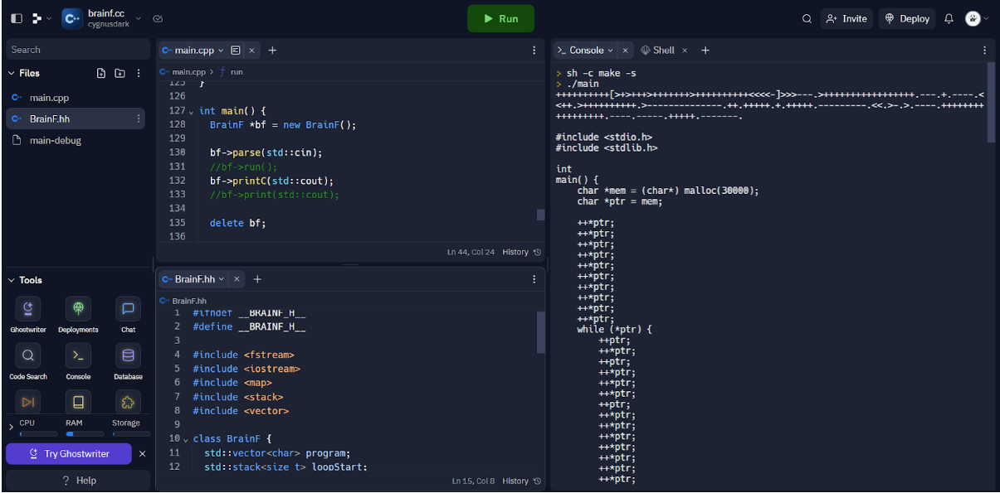
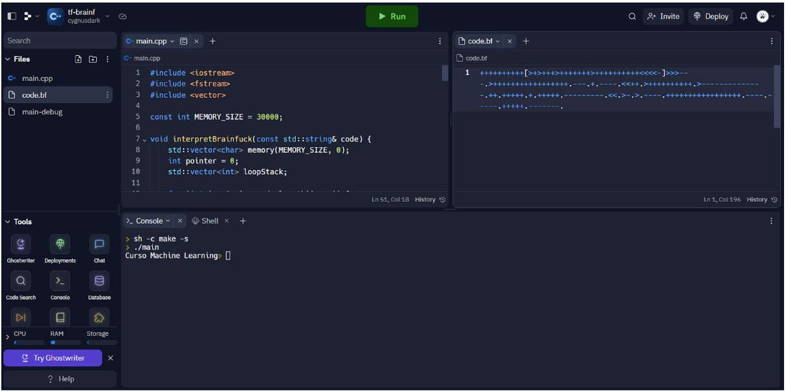
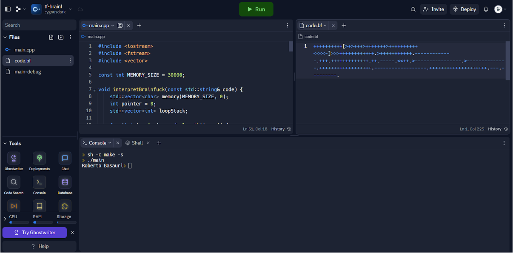
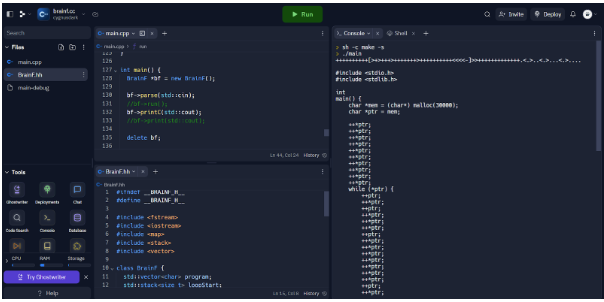

# Exposición: https://www.youtube.com/watch?v=iLUIo7DoACA
# Trabajo Final Machine Learning
### Curso: Teoría de Compiladores
### Sección CC61
### Profesor: Canaval Sánchez, Luis Martín
### Alumnos
- Arroyo Bonifaz, Luis Roberto u201716094
- Basauri Quispe, Roberto Carlos u20181c074

# Introducción

El presente trabajo busca desarrollar un compilador para el lenguaje esotérico BrainF. Además poder utilizar llvm para obtener una compilación más óptima.

# Marco Teórico

LLVM comenzó como un proyecto de investigación en la Universidad de Illinois bajo la dirección de Vikram Adve y Chris Lattner , el objetivo era poder desarrollar una infraestructura para desarrollar compiladores modernos y que sea capaz de soportar compilaciones estáticas y dinámicas de distintos lenguajes de programación. LLVM ayuda a poder optimizar los tiempos de compilación, de enlazado y de ejecución al convertir código en lenguaje intermedio a código ensamblador.

BrainFuck es un lenguaje de programación desarrollado por Urban Muller, y está basado en las máquinas de Turing. El programa consta de un vector de al menos 30 000 bytes iniciados en cero, un puntero que comienza en la posición 0 que irá moviéndose dependiendo de las instrucciones que se brinden. Los comandos para el programa son los siguientes:

# Desarrollo

Diagrama de clase

Diagrama de flujo

# Pruebas

Los testing se harán de dos formas. Usando el código que genera el código de BrainFuck a C, y usando el código que genera el string result de BrainFuck a String.

### TESTING 1:

Datos: “Hola mundo!” en BrainFuck.

Salida: Código en C siguiendo el reglamento de BrainFuck.

Datos: “Hola mundo!” en BrainFuck

Salida:  String “Hola mundo!”

### TESTING 2:

Datos: “Curso Machine Learning” en Brainfuck

Salida: Código en C siguiendo el reglamento Brainfuck.

Datos: “Curso Machine Learning” en Brainfuck.

Salida: String “Curso Machine Learning”.

### TESTING 3:

Datos: “Luis Arroyo” en Brainfuck

Salida: Código en C siguiendo el reglamento Brainfuck.

Datos: “Luis Arroyo” en Brainfuck.

Salida: String “Luis Arroyo”.

### TESTING 4:

Datos: “Roberto Basauri” en Brainfuck

Salida: Código en C siguiendo el reglamento Brainfuck.

Datos: “Roberto Basauri” en Brainfuck.

Salida: String “Roberto Basauri”.

### TESTING 5:

Datos: “Ibrahim Imanol” en Brainfuck

Salida: Código en C siguiendo el reglamento Brainfuck.

Datos: “Ibrahim Imanol” en Brainfuck.

Salida: String “Ibrahim Imanol”.

### TESTING 6:

Datos: “

+

++

+++

++++

” 

en Brainfuck

Salida: Código en C siguiendo el reglamento Brainfuck.

Datos: “

+

++

+++

++++

” 
en Brainfuck.
Salida: String ““

+

++

+++

++++

””.

NOTA: Para la primera parte, el código lee directamente el código Brainfuck desde consola y el resultado está puesto en la parte izquierda. Mientras que para la segunda parte, el código lee un archivo llamado “code.bf” y el resultado está puesto en la parte de abajo.

# Conclusiones

- El proceso de traducción del código Brainfuck a código C implica un pseudo desarrollo de un parser y lexer. Si bien no fueron implementados en flex-bison. Estos simulan el comportamiento tomando los tokens requeridos por el brainfuck (< > [ ] , . - +) mientras que el parser verifica la estructura del código y genera el valor esperado, mas no procesando un árbol de análisis. 

- La implementación demuestra la capacidad de transformar una abstracción (Brainfuck) en otro lenguaje más estructurado y familiar (C). Esta transformación implica el mapeo de instrucciones y estructuras de control de Brainfuck a código C equivalente.

# Bibliografía

- The LLVM Compiler Infrastructure Project. (s/f). Llvm.org. Recuperado el 2 de julio de 2023, de https://llvm.org/
- Wikipedia contributors. (s/f). Brainfuck. Wikipedia, The Free Encyclopedia. https://es.wikipedia.org/w/index.php?title=Brainfuck&oldid=152018064
